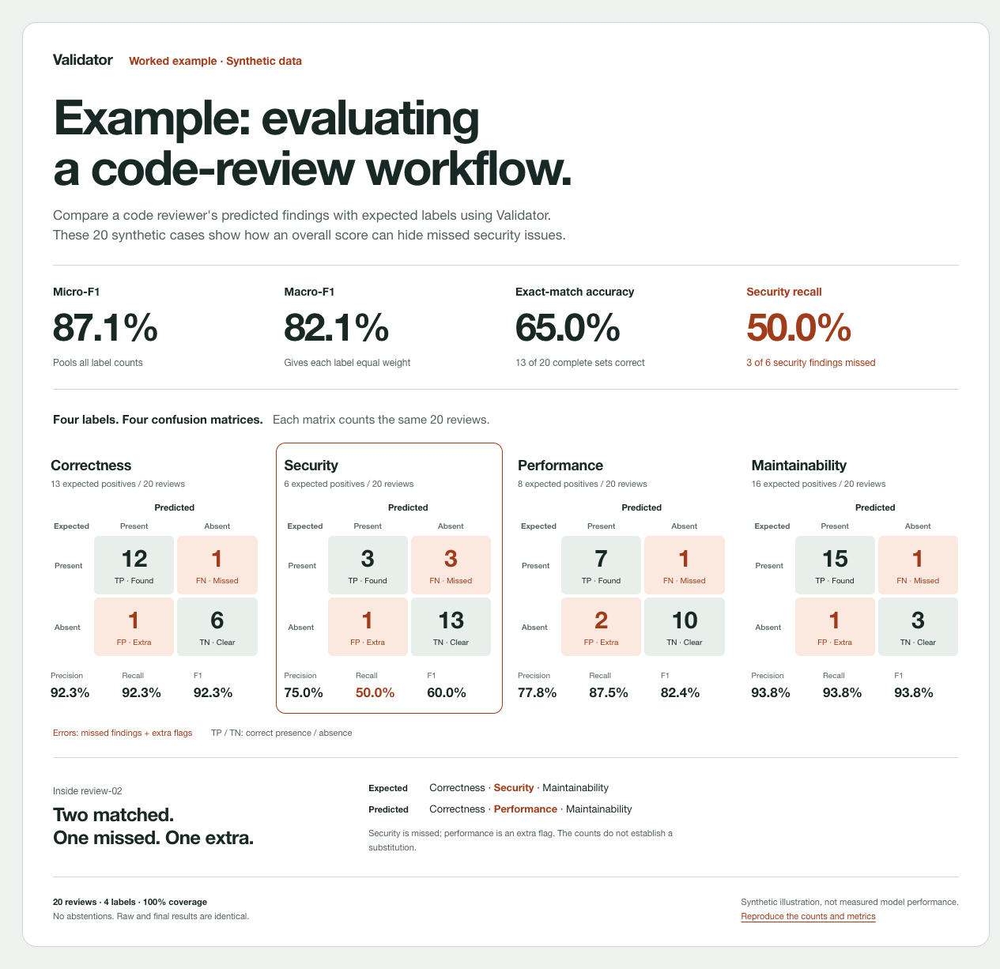

<h1 align="center">Validator</h1>

<h3 align="center">Find the errors. Measure what changes.</h3>

  A command-line tool that compares <strong>expected labels</strong> with
  <strong>generated outcomes</strong>. 
  Works with single-label and multi-label
  classifiers, including Jev workflows.

  <strong>1. Bring your data.</strong> Pair reviewed expected labels with your workflow's saved predictions. 
  <strong>2. Find the mistakes.</strong> See missed labels, false alarms, and the cases behind them. 
  <strong>3. Check your changes.</strong> Compare runs to see what improved and what regressed.

  

<h1 align="center">Worked example  Evaluating a code-review workflow</h1>

  <strong>87.1% micro-F1. Half the security findings missed.</strong> 
  These 20 synthetic reviews show how Validator exposes a weakness behind the average.

  <a href="assets/classification-matrix.html">
    <picture>
      <source media="(max-width: 600px)" srcset="assets/classification-matrix-mobile.png">
      
    </picture>
  </a>

  <em>Synthetic example, not measured model performance. Figure based on Validator's JSON results.</em>

 

  <a href="examples/readme-code-review/README.md"><strong>Try the worked example &rarr;</strong></a> 
  Reproduce the results without model calls or provider credentials. 
  The guide explains the matrices, metrics, and commands.

 

  <a href="examples/jev-poc/PORTFOLIO.md">More use cases</a> &nbsp; &middot; &nbsp;
  <a href="schemas/">Input formats</a> &nbsp; &middot; &nbsp;
  <a href="architecture.md">Architecture</a> &nbsp; &middot; &nbsp;
  <a href="docs/specs/validator-v1.md">Specification</a>

