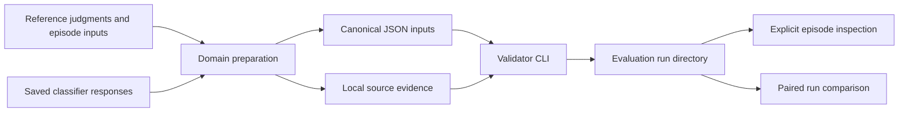
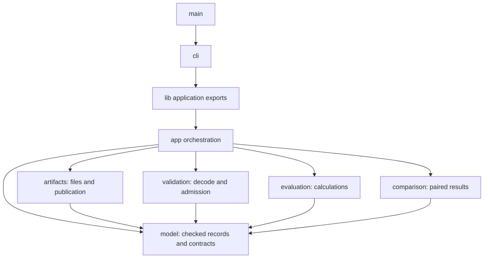
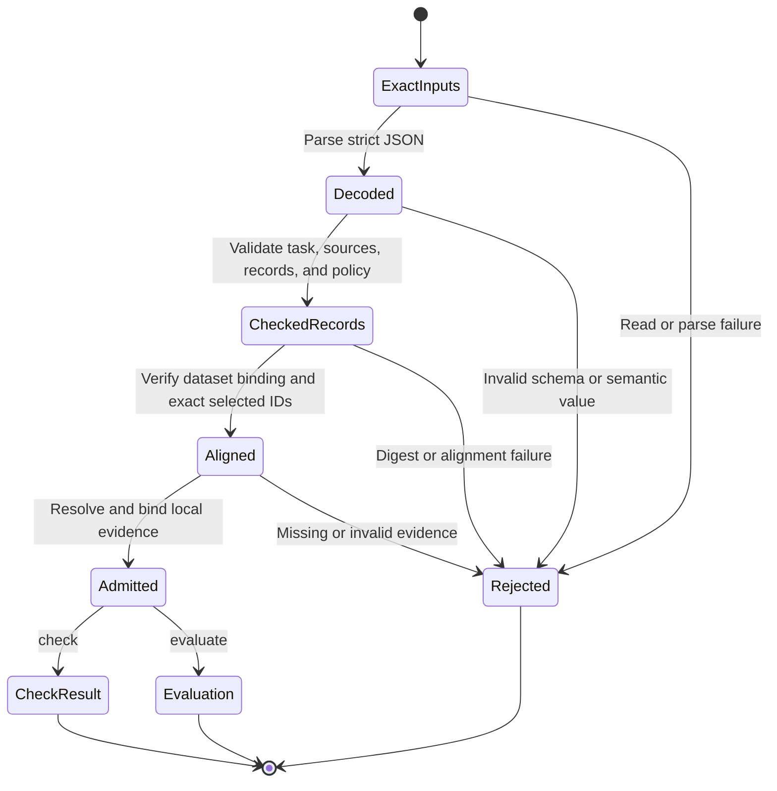
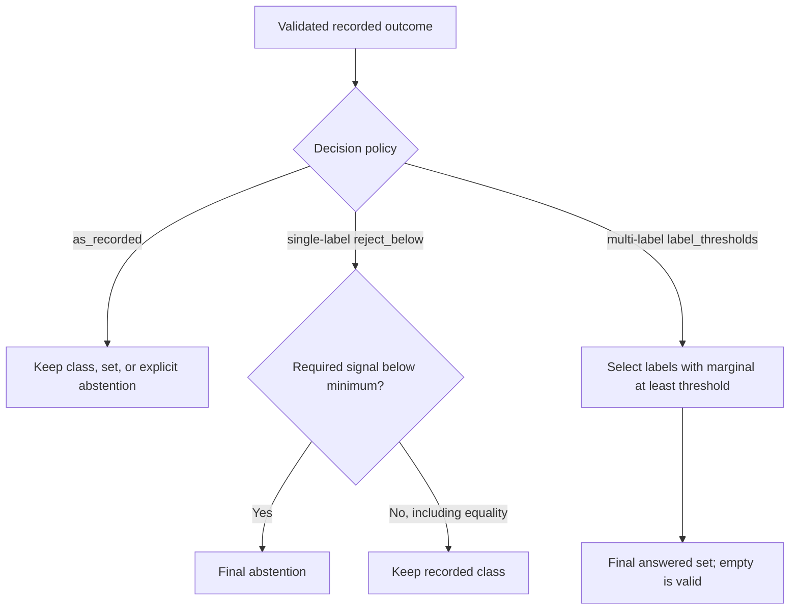
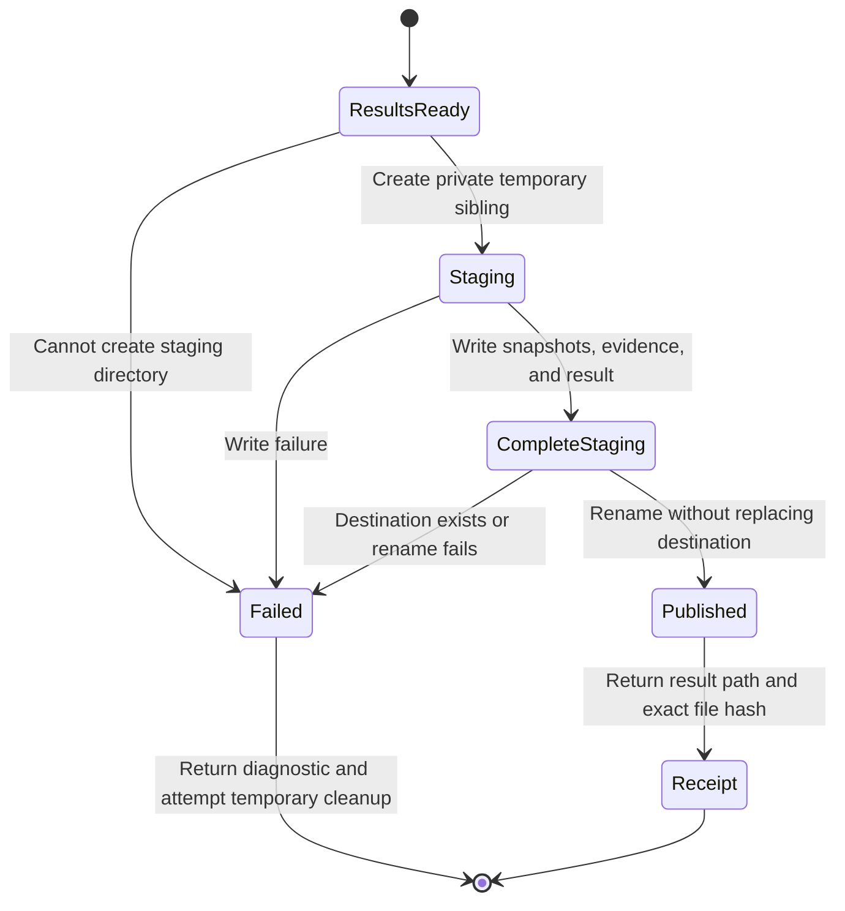
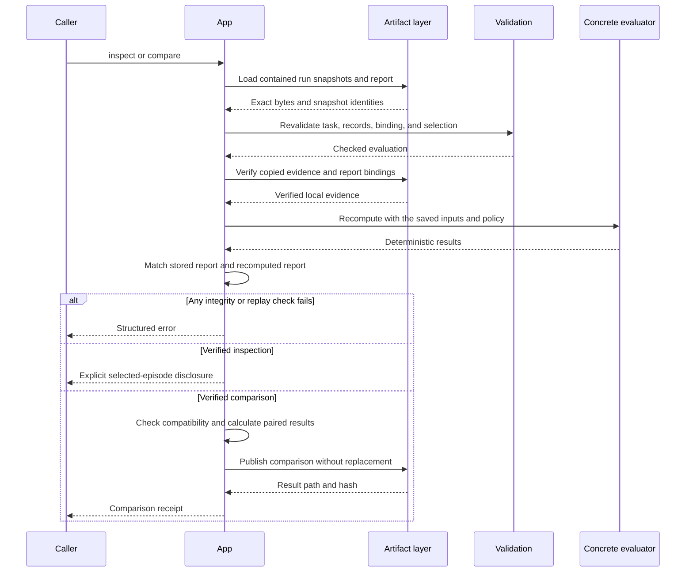

# Validator architecture

Validator evaluates saved classification predictions against explicit reference
labels. It validates the inputs, calculates task-specific results, and publishes
a self-contained run directory that can be checked again before inspection or
comparison. Classifier execution and reference adjudication happen outside
Validator.

This overview describes the implemented `validator 0.1.0` executable, which uses
wire format `2` and specification version `1.2-draft`. It is for developers and
operators who need to understand the system's boundaries and behavior. The
[specification](docs/specs/validator-v1.md) and
[shared data model](docs/specs/validator-data-model.md) define the detailed
contracts; this document explains how their implementation fits together.

The state diagrams describe logical processing stages. They do not represent a
database-backed workflow engine or additional fields stored in every artifact.

## System boundary

Validator is a local, synchronous command-line program. It consumes files rather
than calling a model provider. A deterministic preparation script converts
domain-specific records into the canonical dataset, predictions, and evaluation
configuration. Preparation also preserves source identities, withheld cases, and
the evidence needed to explain transformations.

The package uses Rust edition 2024 and pins toolchain `1.98.1`. The verified
installation is on macOS; artifact permissions and no-replace publication use
Unix filesystem facilities. Serde handles wire serialization, `sha2` hashes
artifacts, `uuid` and `time` supply run metadata, and `rustix` supplies filesystem
operations. `jsonschema` is a test dependency rather than a runtime schema service.

The following diagram separates upstream decisions from Validator's work.



Preparation owns domain interpretation: label mapping, persistent episode UUID
assignment, scalar-to-class boundaries, and separation of reference judgments
from classifier-visible inputs. Validator checks the resulting contract but does
not determine whether a reference label is true or a source's provenance claim is
truthful. A preparation descriptor binds its method and configuration to local
script, raw-source, and receipt evidence; Validator does not execute that code.

The [Chord preparation script](scripts/acceptance/prepare_chord.py) is a concrete
adapter for the frozen acceptance case, not a dependency of the Rust evaluator.
Its [independent oracle](scripts/acceptance/oracle_chord.py) supplies expected
results for verification. Neither script is a second runtime state store.

## Capabilities and command boundaries

The four commands use one application API and the same input and artifact rules.
Successful execution means that the operation completed, not that the classifier
met a quality threshold.

| Command | Inputs | Result and side effects |
|---|---|---|
| `check` | Dataset, predictions, configuration, and referenced evidence | Returns a JSON admission result with integrity counts, selected IDs, and signal availability. It does not score or publish output files. |
| `evaluate` | The same canonical inputs | Calculates results, publishes a complete run directory, and returns a receipt identifying `report.json` and its SHA-256. |
| `inspect` | A saved run and one selected episode UUID | Verifies and replays the run, then returns that episode's input, target, prediction, resolved source definition, configuration, and result evidence. |
| `compare` | Two saved runs and an output destination | Verifies both runs, checks compatibility, calculates paired changes, publishes `comparison.json`, and returns its receipt. |

Machine results use UTF-8 JSON with `schema_version`, `kind`, and `status`.
`evaluate` and `compare` return small receipts rather than printing entire reports.
Receipt paths are absolute; their hashes identify the exact result-file bytes.
Help and version output are text exceptions. Errors also produce one structured
JSON document on stdout; any progress belongs on stderr.

The nine [published schemas](schemas/v2/) cover datasets, predictions,
configuration, reports, comparisons, inspection results, check results, receipts,
and errors. Runtime admission uses private Rust decoding and semantic checks.
JSON Schema conformance is tested separately; a schema document alone cannot
establish cross-record alignment or provenance completeness.

## Components and dependency direction

The implementation is one Cargo package with one binary and one library. The
library exposes the small application API needed by the CLI and integration
tests; it is not a separately supported SDK. Most modules and constructors remain
private to the crate.

The arrows below show the main dependency directions, not the order of every
function call. Shared diagnostics are omitted from the diagram for readability.



Each component has a defined responsibility.

| Component | Responsibility | Boundary |
|---|---|---|
| [main](src/main.rs) and [cli](src/cli.rs) | Start the process, parse arguments, call the application API, serialize results, and select exit codes. | No scoring or artifact implementation. |
| [lib](src/lib.rs) | Declare modules and expose application operations, option/result types, diagnostics, and contract constants. | No business logic or public mutable model construction. |
| [app](src/app.rs) | Coordinate loading, admission, evaluation, replay, comparison, and publication. Supply run identities and timestamps. | Owns orchestration across pure code and filesystem code. |
| [model](src/model.rs) and its submodules | Define checked identities, vocabularies, episodes, sources, policies, evaluations, and typed result variants. | Does not depend on application, scoring, or filesystem modules. |
| [validation](src/validation.rs) and [wire](src/validation/wire.rs) | Decode untrusted JSON, enforce structure and semantics, verify supplied digest relationships, and align records. | Receives bytes and values through arguments; does not load files. |
| [evaluation](src/evaluation.rs) and its task modules | Apply explicit policies and calculate counts, metrics, bins, and episode diagnostics. | Pure calculations over checked inputs; no clocks, randomness, files, or network. |
| [comparison](src/comparison.rs) | Check compatibility, define paired populations, and calculate transitions and metric deltas. | Receives verified data; does not load or trust run directories itself. |
| [artifacts](src/artifacts.rs) | Read files, hash exact bytes, bind evidence, verify containment, and publish without replacement. | Does not calculate classifier metrics. |
| [error](src/error.rs) | Preserve typed diagnostic codes, stages, safe messages, and exit categories. | Diagnostic text does not carry opaque payloads or credentials. |

For example, report builders receive model-owned `ArtifactSnapshot` references.
The application extracts these references from the filesystem module's
`InputArtifacts`. This keeps report construction independent of the component
that loaded the files. Likewise, the application explicitly recomputes restricted
evaluations before asking comparison code to assemble paired results.

## Canonical records and checked ownership

A dataset declares one task kind, an ordered label vocabulary, and episodes.
Each episode has an externally assigned UUID, an opaque input, and a complete
expected target. Predictions bind the SHA-256 of the exact whole dataset file and
provide one source-referenced outcome for each selected episode. Configuration
declares the population, its `development` or `held_out` role, and the decision
policy.

Canonical refers to the agreed wire structure, not a canonical-JSON hashing
algorithm. Changing whitespace in a dataset changes its digest even if its parsed
meaning is unchanged. Comparison and prediction bindings use that byte identity.

`SourceDefinition` records model and question configuration, evidence paths,
observation definitions, and any preparation descriptor. Source IDs are local to
one prediction artifact. An identical ID in another run does not prove an
identical source.

Wire records are temporary, untrusted representations. Validation constructs a
closed `ValidatedTask` variant containing either `SingleLabelEvaluation` or
`MultiLabelEvaluation`. Each owns a checked vocabulary, population, sources,
policy, signal availability, and aligned rows. Checked constructors enforce the
invariants; callers cannot deserialize arbitrary JSON directly into an evaluation
or mutate its fields to bypass admission.

Each aligned row owns one `Episode<Target>` and its corresponding prediction.
The episode owns the opaque input. Evaluators borrow the checked IDs and targets;
they do not copy the input into metric or comparison rows. Exact submitted file
bytes are retained separately for snapshots. Inspection obtains the selected
input from the validated episode only after replay succeeds.

Label indexes belong to their vocabulary. Label sets and probability vectors
use vocabulary order internally, avoiding repeated string interpretation during
scoring and preventing indexes from different datasets from being mixed.

## Admission lifecycle

Every new evaluation crosses the same admission boundary. Malformed records are
not removed so that the remaining rows can be scored.



Strict decoding rejects duplicate JSON keys, unknown fields or tags, missing
required values, and unsupported wire versions. Semantic admission checks UUIDs,
vocabularies, task-specific targets and outputs, source references, observations,
scoring signals, and policy prerequisites. Opaque JSON is retained where the
contract permits it; its contents are not reinterpreted as a classification task.

Omitting `episode_ids` selects the whole dataset. An explicit empty array selects
none. Prediction IDs must equal the selected golden IDs exactly. To evaluate a
subset, preparation supplies a matching prediction subset still bound to the
whole dataset's bytes. The entire submitted artifacts are validated before
scoring, including records or source definitions that do not contribute selected
episodes.

## Two classification models

Single-label classification selects one class from a vocabulary, or explicitly
abstains. It can have two classes or many classes; it does not mean one-class
anomaly detection. Multi-label classification selects a set of labels, including
the empty set, or explicitly abstains for the whole episode.

The task types share admission and artifact infrastructure but have separate
targets, outputs, policies, probability representations, and evaluators.

| Property | Single-label | Multi-label |
|---|---|---|
| Expected target | One class | Complete set of present labels |
| Answered outcome | One class | A possibly empty label set |
| Correctness | Class equality | Exact set equality |
| Scoring probabilities | Categorical vector over every class | One marginal probability for every label |
| Vector constraint | Components in `[0,1]`; sum within the fixed tolerance of one | Components in `[0,1]`; no cross-label sum constraint |
| Hard results | Confusion matrix, accuracy, class metrics, and abstention/coverage accounting | Per-label binary counts, exact-set results, micro/macro metrics, Hamming loss, and coverage |
| Probability results | Categorical log loss, Brier score, and applicable signal diagnostics | Per-label binary log loss and Brier score, their means, and marginal bins |

An answered empty set says that no label applies. Abstention says that no
episode-level decision was made. A missing prediction row is an alignment error,
and a missing marginal key is invalid probability evidence. These states are not
interchangeable. Multi-label v1 does not support partially labeled gold,
per-label abstention, label counts, or a power-set encoding as single-label classes.

## Observations, scoring signals, and policies

Named observations preserve what a classifier returned: scalars, categorical
vectors, marginal vectors, reported confidence, and auxiliary Bernoulli values.
Definitions explain their meaning. Their presence does not activate a scoring
family, supply a missing scoring signal, or establish reference labels for an
auxiliary task.

Top-level `probabilities` and `confidence` have stronger scoring contracts. For
example, observed categorical values `[0.5, 0.49]` can be retained without
normalization, while the same scoring vector fails the categorical sum check.
Marginals `[0.9, 0.8]` are valid because labels can overlap. Valid categorical
scoring vectors within the fixed `1e-9` sum tolerance have normalized working
values; original parsed values and exact snapshot bytes remain available.

The general `classifier` source can record a class that differs from probability
argmax. The single-label-only `scored_choice` profile instead requires a class,
complete categorical probabilities, reported confidence, and a selected class
among the exact maxima. It is an output contract, not a provider integration.

Raw results describe recorded outcomes. Final results describe the explicitly
selected policy. The following diagram shows policy behavior after its input
prerequisites have passed admission.



`reject_below` requires class outcomes and its chosen signal on every row.
`label_thresholds` requires answered label sets, complete marginals, and a threshold
for every label. Supplying raw abstentions to either policy is invalid; neither
policy fills in missing answers. Probability evidence remains the submitted
evidence even when the final hard decision changes. There are no inferred
thresholds or policy chains.

Metric populations make the effect visible. If `N` is the selected episode count,
`G` the answered count, and `K` the label count, an episode-level accuracy uses an
episode population, while a multi-label marginal mean covers `N*K` label
decisions. Answered-only binary metrics cover `G*K` decisions. The report records
the population count, unit, scope, and ratio operands rather than leaving the
denominator implicit.

Metric status is separate from command status. A completed report can contain
`not_applicable` for an absent signal family, `no_data` for an empty applicable
population, or an undefined-denominator status. Consumers must read these fields
rather than interpret a zero or null as a universal meaning. Infinite valid losses
use explicit status instead of nonstandard JSON infinity tokens; fatal arithmetic
or accounting failures stop the operation.

## Persistent state and publication

Validator has no SQLite database, other database dependency, background service,
or persisted job queue. During a command, checked Rust values hold working state.
Between commands, the durable state consists of files in evaluation and comparison
directories. Fizzy tracks development work; it is not part of the executable.

A successful evaluation directory has this layout:

```text
run/
  golden.json
  predictions.json
  config.json
  report.json
  evidence/
    0.bin
    1.bin
```

The `evidence/` directory is present only when evidence was supplied; its number
of files follows the source bindings. The three JSON input snapshots preserve
the submitted bytes. `report.json` holds the run identity, effective policy,
population, manifest, sources, raw/final results, probability results, diagnostics,
and sorted episode evidence. Comparison output contains `comparison.json` and
references the source runs and their report hashes.

Publication makes a complete directory visible through one no-replace rename.



Directories use mode `0700`, and files use mode `0600`. An existing destination
is not overwritten. Normal publication errors attempt to remove staging files;
the protocol does not claim crash-resumable jobs or automatic cleanup after a
process is killed. A leftover temporary directory is not a published result.
Atomic visibility is distinct from a promise of database-style crash durability.

Run and comparison IDs are UUIDv7 values with UTC timestamps. Identical inputs
reproduce decisions, counts, ordering, statuses, and numerical results within the
defined tolerance; independently created runs have different identity metadata
and therefore need not have identical report bytes. `parent_run_id` records
lineage only. It does not inherit state or merge runs.

## Replay, inspection, and evidence boundaries

A saved report is not trusted merely because it parses. Both inspection and
comparison reconstruct a checked evaluation from its snapshots, verify evidence,
recompute results, and compare the recomputed report with the stored one.

The sequence below shows the shared trust boundary and the two consumers of a
verified run.



Evidence is bound by `(source_id, evidence_index)`. Sources are enumerated in
UTF-8 byte order; their evidence arrays retain index order. Each entry receives a
global ordinal and its own `evidence/n.bin` copy, even when paths repeat. This
avoids basename collisions and gives replay an exact expected layout.

Replay checks source IDs, array indexes, original path strings, ordinal paths,
hashes, and complete one-to-one coverage. It resolves stored files within the run
directory, including containment after symlink resolution. Original source paths
are provenance strings during replay and are not opened. A complete run can
therefore move without requiring its original input or evidence locations.

Reports omit opaque episode inputs and arbitrary raw evidence bodies. Inspection
is the deliberate disclosure operation for a selected episode, after verification.
Snapshots still contain sensitive data and need appropriate filesystem handling.
SHA-256 bindings detect inconsistent artifacts; they do not authenticate a fully
rewritten, internally consistent set of snapshots and manifests.

## Comparison behavior

Default comparison requires the same golden-file digest, task kind, ordered
vocabulary, selected IDs, evaluation role, and metric/numerical semantics. Source
definitions, predictions, and policies can differ; the comparison records these
differences rather than assuming matching source IDs mean matching origins.

With `--intersection`, the application restricts both checked evaluations to the
shared IDs and reruns their concrete evaluators. It does not subtract aggregates
computed on different populations. The comparison discloses shared IDs and each
side's exclusions. Even an empty intersection preserves original signal
availability: applicable families have `no_data`, while absent families remain
`not_applicable`.

Every compared episode belongs to exactly one final-correctness category:
`both_correct`, `recovered`, `regressed`, or `neither_correct`. Changed outcomes
are recorded separately. Single-label transitions cover classes and abstention;
multi-label transitions use a separate `absent`/`present`/`abstained` table for
each label. Whole-episode abstention maps each label to `abstained`.

Deltas are candidate minus baseline and are numeric only when both metric
statuses are `defined`. Each metric has its own direction; a positive delta is
not inherently an improvement. Answered-only comparisons disclose each side's
answered IDs and their overlap. Validator emits no overall winner, significance
judgment, or claim that a targeted subset improved the full population.

## Failure behavior and verification boundary

Failures preserve typed codes and stages across the application and CLI. Exit
code `2` covers input, configuration, alignment, provenance, and comparison
contract errors; `3` covers filesystem failures and existing destinations; `4`
covers numeric and internal-accounting failures. Exit code `0` describes successful
execution and can accompany poor classifier results or an empty population.

The [verification record](docs/acceptance/validator-v1.md) identifies the accepted
build and its evidence: 159 Rust tests, clean warning-denied Clippy, a locked
release build, network-denied execution, and independent structural review.
Prepared real-data inputs and the synthetic multi-label oracle also have
independent review records. The final fresh-agent end-to-end demonstrations and
full original DoD closure were deferred when development stopped. This overview
describes the implementation without claiming those unexecuted results.
