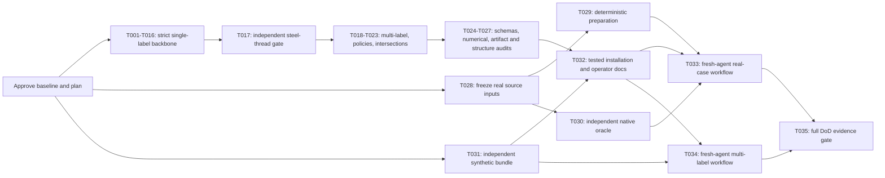

# Validator agent delivery plan

Date: 2026-09-18. Authority: **Ratified**. Scope: authorized implementation.

This revision replaces the earlier ten broad work packages with bounded agent
contracts and source-level verification coverage. The user has now authorized the
team to build against this plan and the reconciled `1.2-draft` specifications.
[Fizzy's planning record](http://localhost:3006/1/cards/182) preserves the planning
outcome; implementation state belongs in the build records. The
[owner's build charter](../dev-team/validator-build/charter.md) governs dispatch,
supervision and the sole-writer/read-only-verifier role boundaries.

## Planning package and authority

Read the [handoff](../handoff/plan-and-build-validator.md),
[main specification](../specs/validator-v1.md), and
[shared data model](../specs/validator-data-model.md). Those two specifications own
behavior and structure; earlier reference documents do not add v1 requirements.
The [task decomposition protocol](/Users/dowwie/.claude/plugins/marketplaces/tasker-marketplace/docs/protocol.md)
is applied through these artifacts:

| Protocol phase | Concrete planning artifact |
|---|---|
| 0: scope, granularity, completion | This plan and [execution contract](validator/execution-contract.md). |
| 1: capabilities, behaviors, end-to-end flows | [Capability map](validator/capability-map.md). |
| 2: every behavior has a physical owner | [Physical map](validator/physical-map.json): exact planned files and shared writers. |
| 3: applicable cross-cutting requirements | Capability map's privacy, input, integrity, numerical, interface, lineage, build/install table. |
| 4: atomic executable tasks | 35 individual JSON task contracts, linked below. |
| 5: causal graph and sequencing | [Dependency graph](validator/dependency-graph.json): nodes, justified edges, phases, topological order and estimated critical path. |
| 6: coverage and completeness audits | [Source coverage](validator/coverage.json), [plan verifier](validator/verify-plan.rb), and [planning audit](validator/planning-audit.md). |

Every task records context/source sections, outcome, exact artifacts, interfaces,
causal prerequisites and their produced inputs, acceptance criteria, named tests
or explicit verification procedures, responsible roles, requirement IDs, and the
common handoff contract. These are static contracts, not active assignments.
The JSON files are not presented as tasker CLI-compatible bundles; no tasker state
or competing operational ledger is introduced.

The coverage map pins both complete specification hashes and each covered source
block. It includes every conformance row: **29 single-label/shared, 21 multi-label,
13 evidence cases**, plus **12 structure checks, eight ACs, and five DoD clauses**.
The other prose, lists, fields, formulas, and examples in the governing portions
are also routed to implementing and verifying tasks. Planned coverage is not
passed-test evidence. Source bibliography sections remain Reference material.

## Outcome and scope

Deliver exactly one offline Rust CLI for single-label and complete multi-label
classification. Keep the prescribed single-package binary/library/module layout,
strict admission, machine-first outputs, immutable evidence, and pure concrete
evaluators. Count/multiset tasks, partial labels, plugins, generic rule engines,
model inference, human-report UI, and surrounding application evaluation remain
out of scope.

Plan/baseline approval was supplied by the user's explicit build instruction and
is recorded in the build charter and session notes. The initial task pins the exact stable compiler,
components, lockfile and actually verified MSRV. Planning observed Rust/Cargo
1.98.1 on `x86_64-apple-darwin`; that observation is not a completed build check.

## Steel-thread decision

**Hypothesis at risk:** strict checked admission, separate observation/scoring
types, exact snapshots, evidence binding and the pure evaluation path can produce
an immutable run that remains inspectable and comparable after relocation with
no access to original source files. These integration seams are unproven in the
current greeting scaffold.

**Complete path:** canonical bytes and local evidence → check → typed single-label
evaluation → complete report/snapshot publication → relocate both runs → verified
recomputation → explicit inspection → identical-population comparison and receipt.
T001–T016 build only the backbone and its first concrete task path; T017 independently
verifies it before multi-label expansion. This is production-shaped functionality,
with real validation, scoring, files, schemas, and commands—not test-only substitutes.

**Fixed thread input:** vocabulary `[A,B,C]`, four UUID-sorted episodes, references
`[A,A,B,C]`; baseline outcomes `[A,abstention,A,C]`; candidate `[B,A,B,C]`;
`classifier` source and `as_recorded` policy. Both artifacts contain these scoring
vectors in episode order:

```text
[0.7,0.2,0.1], [0.7,0.2,0.1], [0.6,0.3,0.1], [0.1,0.1,0.8]
confidence: [0.8,0.8,0.3,1.0]
```

Retain a categorical observation `{x:0.5,y:0.49}` on the abstained baseline row,
with its source definition; input contains integer `9007199254740993`. Bind two
same-basename evidence files from different directories, including a parent-relative
source path. Freeze fixture UUIDs once in T017 and bind prediction hashes to the
exact serialized golden file; no production-generated expected results.

**Pass evidence:** baseline `D=2,E=1,U=1`, accuracy `1/2`, coverage `3/4`, selective
accuracy `2/3`, macro-F1 `1/2`. Probability Brier is `0.30` and log loss is
`(-2*ln(0.7)-ln(0.3)-ln(0.8))/4`; argmax accuracy is `3/4`. Probability bins include
four selected rows; baseline confidence bins include three and exclude episode 2.
Comparison recovers episodes 2/3, regresses 1, and keeps 4 correct. Relocated inspect
and compare succeed, input is disclosed only through inspection, receipts name/hash
the exact result file, and schemas validate output. Duplicate keys, nonconforming
scoring probabilities, tampered evidence and existing destinations fail without
publishing a partial success directory.

**Decision:** accept T017 only with saved independent evidence. A failure blocks
expansion and returns the failing seam for correction and reverification. Do not
use coercion, fallback routes, relaxed tolerances or changed oracles. A pass confirms
this integration design, not multi-label correctness, general numerical coverage,
reference truth or project completion.

## Task contracts and construction DAG

Each task targets a coherent 2–6-hour engineering sitting. Ranges below are rough
planning estimates, not agent runtimes or a delivery commitment. They include
local implementation/test work; independent review, integration contention, and
rework can add cost. Use observed throughput at the steel-thread gate to update
remaining estimates. No calendar deadline, agent count, model roster, compute
budget or parallel staffing is assumed.

| Contract | Observable outcome | Causal prerequisites | Estimated hours |
|---|---|---|---|
| [T001](validator/tasks/T001.json) | Pin the Rust package and establish typed errors and numerical constants | Approval gate only | 2–3 |
| [T002](validator/tasks/T002.json) | Implement strict wire decoding without losing opaque numbers | T001 | 3–5 |
| [T003](validator/tasks/T003.json) | Construct shared identities and vocabulary-owned labels | T001 | 3–4 |
| [T004](validator/tasks/T004.json) | Validate sources and retain typed observations with preparation bindings | T002, T003 | 4–6 |
| [T005](validator/tasks/T005.json) | Validate single-label outputs and complete scoring families | T002, T003, T004 | 3–5 |
| [T006](validator/tasks/T006.json) | Align selected episodes into a checked single-label evaluation | T005, T003 | 3–5 |
| [T007](validator/tasks/T007.json) | Implement checked metric arithmetic and explicit status precedence | T001 | 2–4 |
| [T008](validator/tasks/T008.json) | Compute single-label matrices and hard-decision evidence | T006, T007 | 3–5 |
| [T009](validator/tasks/T009.json) | Compute categorical losses and distinct probability/confidence diagnostics | T008, T005, T007 | 4–6 |
| [T010](validator/tasks/T010.json) | Publish strict schemas for all three canonical input contracts | T001 | 3–5 |
| [T011](validator/tasks/T011.json) | Load exact bytes and bind every evidence entry deterministically | T004, T003 | 3–5 |
| [T012](validator/tasks/T012.json) | Publish complete artifact directories without replacing destinations | T011 | 3–5 |
| [T013](validator/tasks/T013.json) | Assemble typed run reports and output schemas | T008, T009, T011 | 3–5 |
| [T014](validator/tasks/T014.json) | Wire check and evaluate through the thin CLI | T006, T010, T012, T013 | 4–6 |
| [T015](validator/tasks/T015.json) | Verify replay and expose explicit selected-episode inspection | T014 | 4–6 |
| [T016](validator/tasks/T016.json) | Compare verified single-label runs on identical populations | T015, T013, T012 | 4–6 |
| [T017](validator/tasks/T017.json) | Verify the complete steel thread before expanding task semantics | T016 | 2–4 |
| [T018](validator/tasks/T018.json) | Construct complete multi-label inputs through the shared admission boundary | T017, T004, T006 | 3–5 |
| [T019](validator/tasks/T019.json) | Compute multi-label hard metrics and exact episode differences | T018, T007 | 3–5 |
| [T020](validator/tasks/T020.json) | Compute marginal losses and per-label probability bins | T019, T018 | 3–5 |
| [T021](validator/tasks/T021.json) | Apply both task-specific decision policies at exact thresholds | T018, T009, T020 | 3–5 |
| [T022](validator/tasks/T022.json) | Add typed multi-label comparison transitions and conditional populations | T016, T020 | 3–5 |
| [T023](validator/tasks/T023.json) | Restrict verified populations for explicit intersection comparisons | T022, T021 | 3–5 |
| [T024](validator/tasks/T024.json) | Audit all nine schema contracts against positive and adversarial outputs | T023, T010, T013 | 3–5 |
| [T025](validator/tasks/T025.json) | Verify numerical conformance with independent exhaustive oracles | T021, T022 | 4–6 |
| [T026](validator/tasks/T026.json) | Verify artifact integrity under hostile and late-failure conditions | T023 | 3–5 |
| [T027](validator/tasks/T027.json) | Verify module boundaries and the locked offline public test suite | T024, T025, T026 | 3–5 |
| [T028](validator/tasks/T028.json) | Freeze private acceptance inputs and persist source episode identities | Approval gate only | 2–4 |
| [T029](validator/tasks/T029.json) | Prepare native Choice and Score artifacts reproducibly | T028 | 4–6 |
| [T030](validator/tasks/T030.json) | Calculate an independent hard-label oracle from frozen native sources | T028 | 3–5 |
| [T031](validator/tasks/T031.json) | Freeze a synthetic multi-label practical bundle and independent oracle | Approval gate only | 2–4 |
| [T032](validator/tasks/T032.json) | Document and verify installation and the machine workflow | T027, T031 | 2–4 |
| [T033](validator/tasks/T033.json) | Run fresh-agent single-label acceptance with the installed executable | T027, T029, T030, T032 | 3–5 |
| [T034](validator/tasks/T034.json) | Run fresh-agent multi-label acceptance with the installed executable | T027, T031, T032 | 2–4 |
| [T035](validator/tasks/T035.json) | Audit accepted evidence and close the full definition of done | T033, T034 | 2–4 |

The machine graph contains all edges and their reasons. The phase view is:



The graph is acyclic. Failure/rework is a review procedure, not a backward
construction dependency. The dependency graph computes the longest path under
the estimates; it does not equate that path with elapsed time for an unknown team.
T010 input schemas, T007 metric arithmetic, and T011/T012 artifact handling can
progress alongside compatible backbone work once their actual prerequisites pass.
T028–T031 are independent of production scoring, deliberately preserving oracle
independence and exposing missing private sources early.

File-level concurrency requires a separate check: `tests/conformance.rs`,
`src/validation.rs`, model/evaluator dispatch files, manifests, and documentation
have multiple writers. The coordinator uses the physical map to serialize shared
writers or integrate isolated changes. Logical readiness alone is not permission
to concurrently edit a shared checkout.

## Agent handoffs and correctness gates

The [execution contract](validator/execution-contract.md) specifies complete
file-based prompts/responses, bounded write scope, dependency artifact hashes,
nonzero named-test execution, independent review, integration and rework rules.
An implementer cannot approve their own work. A verifier who fixes code needs
another verifier for that fix. The integrator reads the full saved response before
accepting a task, checks verified hashes against integrated inputs, and reruns
affected checks after conflict resolution.

Local tests ship with each behavior. Later audit tasks independently check them;
they are not permission to defer verification. Numerical oracles cannot call the
production evaluator. Every compound source case requires all of its subcases.
A green command that executes zero filtered tests is rejected as evidence.

At T017, T027 and T035 run the four mandated pinned-toolchain commands:

```sh
cargo fmt --all -- --check
cargo clippy --all-targets --all-features --locked -- -D warnings
cargo test --all-features --locked
cargo build --release --locked --bin validator
```

T027 also reviews module dependency direction and checked/private type boundaries;
Cargo does not enforce those automatically. T035 requires actual evidence for
all source clauses, table cases, structure checks, ACs and DoD clauses in
`docs/acceptance/validator-v1.md`: implementation/test/review locations, commands,
expected/actual results, exits and source/input/result hashes. No missing proof
can be replaced by an overall completion claim.

## Practical acceptance and tracking

T028–T030 freeze the exact Chord sources before calculating expected results,
retain the full 630-source/603-labeled/27-withheld accounting, persist UUID mapping,
and independently derive native Choice/Score hard-label counts. Preparation keeps
original scalars, distributions, confidence and auxiliary observations, source/prompt
differences, reference limitations, and scalar-route boundaries/ties. Failed parsed
projections are checked against saved raw evidence; missing native outcomes cannot
be hidden by dropping rows or inventing abstention.

Use the protected bundle root
`/Users/dowwie/.local/share/validator/acceptance/chord630/`; no private episode payloads
enter Git/public fixtures. This plan does not freeze or alter source data. Run
hard-label artifacts with retained observations and no probability scoring, plus
strict rejection of invalid scoring vectors. Public conformance fixtures exercise
explicit prepared vectors. Cohorts and targeted passes retain exact selections.

T031 supplies the independent synthetic multi-label bundle. T033/T034 use fresh
agents with no inherited implementation context, only installed CLI, documentation,
schemas and frozen inputs/oracles. They must complete preparation, checking,
evaluation, structured failure discovery, inspection and comparison without reading
implementation or writing scoring code. Save commands/stdout/stderr/exits/hashes
and full response artifacts before claiming acceptance.

After approval, search General in Fizzy before creating/updating implementation
outcomes. Promote a task to a card when it needs independent ownership, verification,
blocker or lifecycle; otherwise use a step under its coherent outcome. Canonical
card links express dependencies. Planning JSON carries no live task states.
No implementation cards or agent assignments are created by this revision.

Replan only the affected contracts when a source change invalidates coverage,
the thread fails, native sources are missing, independent oracles disagree, a
public-contract ambiguity emerges, or task size/resource use exceeds its bound.
Keep source/plan authority explicit and do not declare completion until the full
DoD evidence gate passes.
